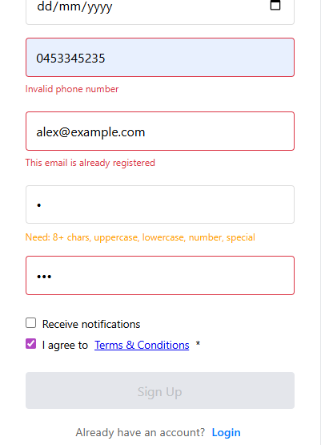

# Secure User Auth System (Full Mock Backend)

<p align="center">
  
</p>

A sophisticated authentication system built with Vanilla JavaScript. It simulates a complete backend environment, including network latency, database interactions (via JSON), and high-level security practices like password hashing and data sanitization.

## 🚀 How to Run

### Option 1: Download as ZIP (Quickest)
1. **Download**: [Click here to download this project folder](https://github.com/ruorc/portfolio/tree/main/projects/auth-system/auth-system.zip)
2. **Extract** the ZIP archive.
3. **Open the folder** in VS Code and click **"Go Live"**.
   *Note: This project uses ES Modules, so it **must** be run through a server (Live Server).*

### Option 2: Clone via Git
1. **Clone the repository**:
   ```bash
   git clone https://github.com/ruorc/portfolio.git
   ```
2. **Navigate to the project**:
   ```bash
   cd projects/auth-system
   ```
3. **Launch**: Open in VS Code and use the **Live Server** extension.

## 🛠 Technologies Used


## 🧠 Technical Features

### Security & Cryptography


*   **Client-Side Hashing**: Uses `SubtleCrypto` (SHA-256) to hash passwords before comparison, ensuring sensitive data is never handled in plain text.
*   **Data Sanitization**: A dedicated `_sanitizeUser` function removes sensitive fields (passwords, keys) from user objects before they reach the UI.
*   **Mock Backend**: Simulates database fetching from `users.json` and artificial network latency for a realistic UX.

### Advanced Form Logic


*   **Complex Input Masking**: Real-time filtering of names and nicknames (preventing double dashes, leading numbers, or illegal characters).
*   **Multi-Step Password Validation**: Dynamic complexity tracker that checks for uppercase, lowercase, numbers, and special symbols.
*   **Smart Registration**:
    *   Terms of Service must be read (alert triggered) before the checkbox becomes active.
    *   Comprehensive Regex validation for Israeli phone formats and global email standards.
*   **Error Handling**: Server-side error simulation that maps backend validation errors back to specific UI fields.

## 📁 Project Structure

*   `api.js`: Core "Server" logic (Login/Register functions).
*   `helpers.js`: Shared utilities (Hashing, Latency simulation).
*   `login.js` & `register.js`: DOM logic and event handling.
*   `data/users.json`: Our "Mock Database".

## 🎮 Key Functionalities

1.  **Secure Login**: Checks credentials against a local JSON database with hashed password comparison.
2.  **Robust Registration**: Enforces strict data formats and prevents duplicate emails.
3.  **Session Management**: Saves the successfully authenticated user to `sessionStorage` for persistent "Welcome" states.
4.  **UX Feedback**: Real-time password strength indicators and field-specific error highlighting.

---
*Note: This project is part of a larger portfolio and demonstrates modular JavaScript architecture.*
