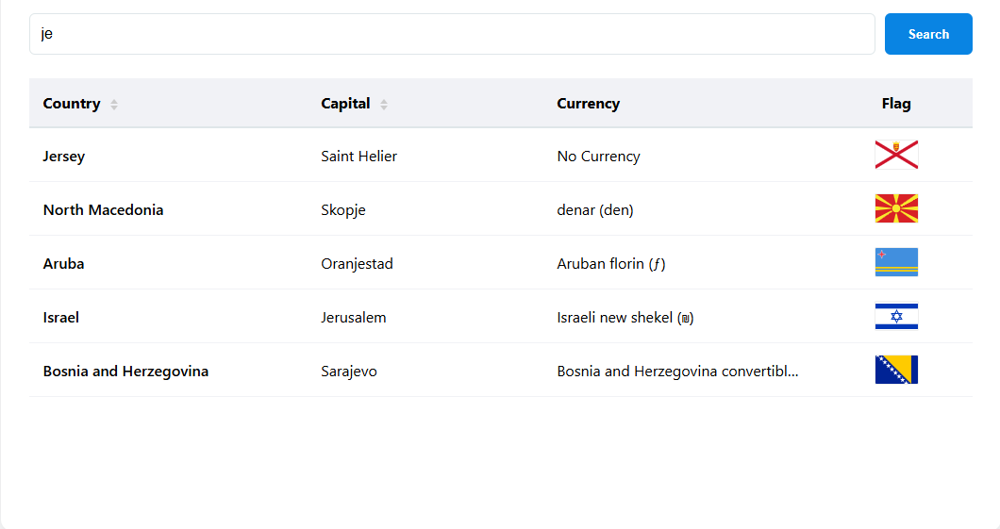

# World Countries Directory

<p align="center">
  
</p>

An interactive dashboard that fetches and displays real-time data about world countries. Users can explore country names, capitals, currencies, and flags with instant filtering and multi-mode sorting.

## 🚀 How to Run

### Option 1: Download as ZIP (Quickest)
1. **Download**: [Click here to download this project folder](https://github.com/ruorc/portfolio/projects/country-explorer/country-explorer.zip)
2. **Extract** the ZIP archive.
3. **Open the folder** in VS Code and click **"Go Live"**.

### Option 2: Clone via Git
1. **Clone the repository**:
   ```bash
   git clone https://github.com/ruorc/portfolio.git
   ```
2. **Navigate to the project**:
   ```bash
   cd projects/country-explorer
   ```
3. **Open in VS Code**:
   Launch the project and use the **Live Server** extension.

## 🛠 Technologies Used


## 🧠 Technical Features

### Data Management


*   **Real-time Data Fetching**: Integrates with the [Rest Countries API](https://restcountries.com/) to pull live data.
*   **Data Normalization**: Processes complex nested JSON objects (like currencies and capitals) into a clean, display-ready format.
*   **Error Handling**: Built-in `try-catch` blocks and user-friendly error messages if the API fails to load.

### Interactive UI


*   **Live Search**: Instant filtering by country name or capital city as you type (no page reload).
*   **Advanced Sorting**:
    *   Toggle between Ascending (A-Z) and Descending (Z-A) order.
    *   Dynamic CSS sort icons that reflect the current state.
*   **Optimized Rendering**: Efficiently rebuilds the table body while maintaining the search context during sorting.
*   **Modern Layout**: 
    *   Responsive table design with fixed layout and text truncation for long strings.
    *   Clean UI with high-quality SVG flags.

## 📊 Key Functionalities

1.  **Smart Search**: Filter through hundreds of countries in milliseconds.
2.  **Sortable Columns**: Click on "Country" or "Capital" headers to reorder the list.
3.  **Visual Indicators**: Up/Down arrows appear on active columns to show sort direction.
4.  **Currency Extraction**: Smart logic to handle countries with multiple or no official currencies.
