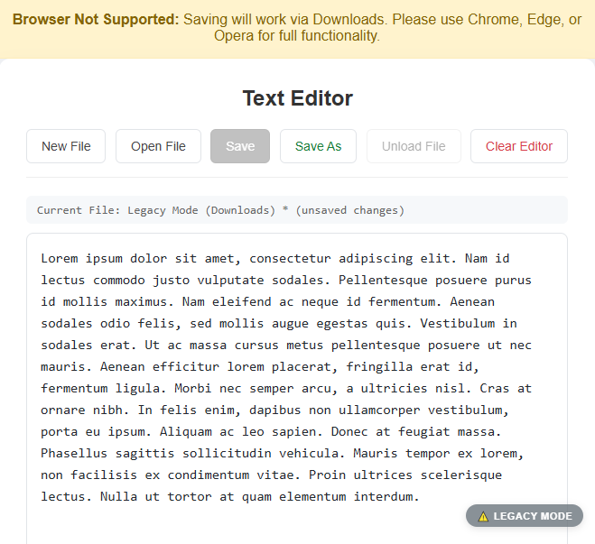

# Modern Web Text Editor (File System API)

<p align="center">
  
</p>

A professional browser-based text editor that provides a desktop-like experience. It features direct local file access, custom asynchronous modal dialogs, and a robust fallback system for maximum browser compatibility.

## 🚀 How to Run

### Option 1: Download as ZIP (Quickest)
1. **Download**: [Click here to download this project folder](https://github.com/ruorc/portfolio/projects/file-operations/file-operations.zip)
2. **Extract** the ZIP archive.
3. **Open the folder** in VS Code and click **"Go Live"** (Live Server).

> [!IMPORTANT]
> **For better functionality, save your work files OUTSIDE the project folder.** This prevents Live Server from refreshing the page automatically and losing your current session.

### Option 2: Clone via Git
1. **Clone the repository**:
   ```bash
   git clone https://github.com/ruorc/portfolio.git
   ```
2. **Navigate to the project**:
   ```bash
   cd projects/file-operations
   ```
3. **Launch**: Open in VS Code and use the **Live Server** extension.

## 🛠 Technologies Used


## 🧠 Technical Features

### Advanced Logic


*   **Asynchronous Dialogs**: Implements a custom `askUser` function using the HTML5 `<dialog>` element and JavaScript **Promises** to handle user confirmations without blocking the main thread.
*   **Modern File Access**: Uses `showOpenFilePicker` and `showSaveFilePicker` for direct read/write operations on the local disk.
*   **Hybrid Support**: Automatically detects browser capabilities and switches to **Legacy Mode** (using `FileReader` and `Blob`) for browsers like Firefox or Safari.

### Professional UX


*   **Dirty State Tracking**: Intelligent detection of unsaved changes, marked by an asterisk `*` in the status bar.
*   **Keyboard Shortcuts**:
    *   `Ctrl + S` — Quick save to the current file.
    *   `Ctrl + Shift + S` — Save as a new file.
*   **Smart UI Management**: Buttons are dynamically enabled/disabled based on the file status and content changes.

## 🎮 Key Functionalities

1.  **New/Open File**: Asks for confirmation if there are unsaved changes before starting a new session.
2.  **Save/Save As**: Direct disk writing with the ability to choose between `.txt`, `.md`, or `.log` formats.
3.  **Unload File**: Safely closes the file handle and resets the editor state.
4.  **Clear Editor**: A quick way to wipe the screen while keeping the disk file safe.
5.  **Legacy Badge**: Visual indicator and warning banner when running on unsupported browsers.

---
*Note: This project requires a secure context (localhost or HTTPS) to use the File System Access API.*
