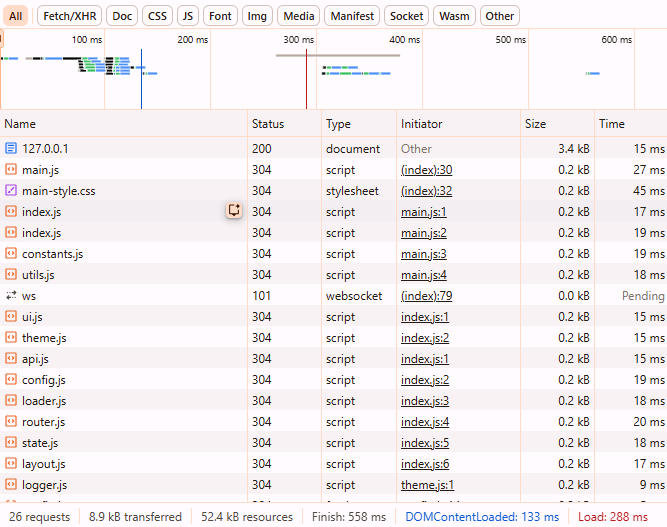

# Custom Single Page Application (SPA) Engine

<p align="center">
  
</p>

A high-performance, lightweight SPA framework built from scratch with Vanilla JavaScript. This engine features a custom routing system, dynamic asset orchestration (JS/CSS), smart preloading, and a multi-level caching system.

## 🚀 How to Run

### Option 1: Download as ZIP (Quickest)
1. **Download**: [Click here to download this project folder](https://github.com/ruorc/portfolio/tree/main/projects/single-page-application/single-page-application.zip)
2. **Extract** the ZIP archive.
3. **Open the folder** in VS Code and click **"Go Live"**.
   *Note: This engine uses ES Modules and Fetch API, so it **requires** a local server (Live Server) to run.*

### Option 2: Clone via Git
1. **Clone the repository**:
   ```bash
   git clone https://github.com/ruorc/portfolio.git
   ```
3. **Launch**: Use the **Live Server** extension in VS Code.

## 🛠 Core Technologies


## 🧠 Technical Architecture

### 🛤 Advanced Routing & Navigation
*   **Hybrid Routing**: Supports both `Hash` (#) and `History API` (pushState) navigation via centralized config.
*   **Smart Preloading**: Monitors `mouseover` events on links to pre-fetch HTML, CSS, and JS before the user even clicks.
*   **Asset Orchestration**: Automatically injects and removes page-specific CSS and JS modules to prevent global scope pollution.

### 💾 Intelligent Data Management
*   **Multi-Level Cache**: Custom caching system with Time-to-Live (TTL) logic and an automated background "Garbage Collector" to prevent memory leaks.
*   **Request Collapsing**: Prevents redundant network requests by tracking and reusing pending Promises for the same resources.
*   **Asynchronous Layout**: Fragments like Header and Footer are loaded independently and injected into the skeleton during the bootstrap phase.

### 🎨 UI & UX Engine
*   **Dynamic Theme Engine**: Persistent Dark/Light mode management with system preference detection and `localStorage` sync.
*   **Smooth Transitions**: Managed lifecycle hooks (`prepareTransition`, `renderPage`) with hardware-accelerated CSS animations.
*   **Lifecycle Hooks**: Every page script can export a `cleanup` function to remove event listeners and prevent memory leaks when navigating away.

## 📁 Project Structure (15+ Modules)

*   `core/`: Router, API, Config, Loader, and State management.
*   `ui/`: UI Rendering, Theme management, and Transitions.
*   `utils/`: Slugs, Path normalization, and File system checks.
*   `data/`: `config.json` — the brain of the application where all routes and asset dependencies are defined.

## ⚙️ Configuration (config.json)
The entire app behavior is controlled via a single JSON file. You can enable/disable scripts or styles for specific pages without touching the core JavaScript:
```json
"pages": {
  "projects": { "hasScript": true, "hasStyle": true },
  "about": { "hasScript": false, "hasStyle": false }
}
```

---
*This engine represents a deep understanding of JavaScript performance, modularity, and the modern web ecosystem.*
