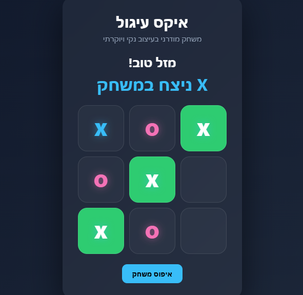

# Modern Tic-Tac-Toe (X-O)

<p align="center">
  
</p>

A clean, modern, and interactive Tic-Tac-Toe game built with Vanilla JavaScript, HTML5, and CSS3. The project features a minimalist UI with smooth transitions and full Hebrew localization (RTL).

## 🚀 How to Run

This project is optimized for the **Live Server** extension in VS Code.

### Option 1: Download as ZIP (Quickest)
1. **Download the project**: [Click here to download this game folder](https://github.com/ruorc/portfolio/tree/main/projects/tic-tac-toe-game/tic-tac-toe-game.zip)
2. **Extract** the ZIP archive on your computer.

### Option 2: Clone via Git
1.  **Clone the repository**:
    ```bash
    git clone https://github.com/ruorc/portfolio.git
    ```
2.  **Navigate to the project folder**:
    ```bash
    cd projects/tic-tac-toe-game
    ```

3.  **Open in VS Code**:
    Open the project folder in Visual Studio Code.
4.  **Launch Live Server**:
    *   Right-click on `index.html` and select **"Open with Live Server"**.
    *   Or click the **"Go Live"** button in the bottom status bar of VS Code.
5.  **Play**:
    The game will automatically open in your default browser (usually at `http://127.0.0.1:5500`).

## 🛠 Technologies Used


## 🧠 Technical Features

### Logic & Architecture


*   **Smart Win Detection**: Uses a `winingMasks` matrix and the `Array.every()` method to validate the winner efficiently after the 5th move.
*   **Move Tracking**: Real-time logging of player moves in an array to manage game state and history.

### DOM & UI


*   **Dynamic Interaction**: Active use of **DOM manipulation** to update game status, toggle player turns, and inject animated symbols (`<span>X</span>`).
*   **Responsive UI/UX**: 
    *   Automatic UI toggling (Instruction text vs. Reset button).
    *   Visual highlighting of the winning combination.
    *   Prevention of illegal moves through button disabling.
*   **Localization**: Native Right-to-Left (RTL) support for Hebrew text and layout.

## 🎮 Game Rules

1.  The game is played on a 3x3 grid.
2.  Players take turns placing their mark (X or O) in an empty cell.
3.  The first player to get 3 of their marks in a row (vertically, horizontally, or diagonally) wins.
4.  If all 9 cells are full and no player has 3 marks in a row, the game ends in a draw.
5.  Press **"איפוס משחק"** (Reset Game) to clear the board and start over.
