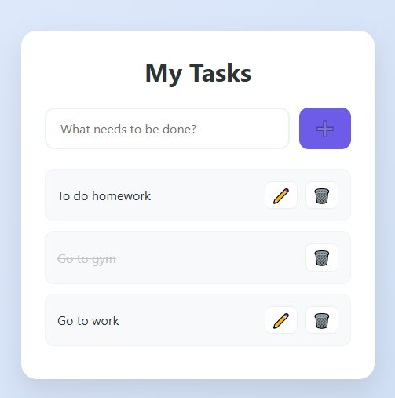

# Modern To-Do List

<p align="center">
  
</p>

A sleek, functional, and responsive To-Do List application. This project focuses on a clean user experience with persistent data storage and intuitive task management.

## 🚀 How to Run

You can run this project locally using one of the following options:

### Option 1: Download as ZIP (Quickest)
1. **Download the project**: [Click here to download this project folder](https://github.com/ruorc/portfolio/projects/to-do-list/to-do-list.zip)
2. **Extract** the ZIP archive.
3. **Open the folder** in VS Code and click **"Go Live"** (Live Server extension).

### Option 2: Clone via Git
1. **Clone the repository**:
   ```bash
   git clone https://github.com/ruorc/portfolio.git
   ```
2. **Navigate to the project**:
   ```bash
   cd projects/to-do-list
   ```
3. **Open in VS Code**:
   Launch the project and use the **Live Server** extension to view it.

## 🛠 Technologies Used


## 🧠 Technical Features

### Data & Logic


*   **Persistent Storage**: Uses `localStorage` to save your tasks. Data remains safe even after refreshing the page or closing the browser.
*   **Full CRUD**: Create, Read, Update (Edit), and Delete tasks seamlessly.
*   **Dynamic UUIDs**: Utilizes `crypto.randomUUID()` for unique task identification and reliable state management.

### UI & UX


*   **Dynamic DOM Rendering**: Tasks are rendered on-the-fly from the state array.
*   **Smart Input**: The "Add" button and "Enter" key are context-aware, preventing empty tasks through real-time input validation.
*   **Interactive Design**: 
    *   Click a task to toggle "Completed" status.
    *   Smooth CSS transitions and hover effects.
    *   Conditional rendering: "Edit" button disappears once a task is marked as done.

## 🎮 Key Functionalities

1.  **Add Task**: Type in the input and click ➕ or press Enter.
2.  **Edit Task**: Click the ✏️ icon to rename a task (using a native prompt).
3.  **Complete Task**: Click on the task text to strike it through.
4.  **Delete Task**: Click the 🗑️ icon to remove a task forever.
